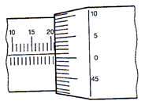

<!--สมมติว่าเริ่มไฟล์เป็นบรรทัดแรก -->
<!--!#@ Code: TSS04207009L2-5 -->
<!--!#@ Title: การใช้เครื่องมือวัดทั่วไป(Measuring Tools) -->
<!--!#@ Subject: ช่างประกอบท่อ ระดับ 2 -->
<!--!#@ Desc: -->
<!--!#@ Q1 no random -->
เวอร์เนียร์คาลิปเปอร์ที่นิยมใช้กันทั่วไป วัดค่าความละเอียดได้เท่าไร  
<!--!#@ C -->
1/10 มม.  
<!--!#@ C -->
1/40 มม.  
<!--!#@ C* -->
1/20 มม.   
<!--!#@ C -->
1/60 มม. 

<!--!#@ Q2 -->
แนวเล็งมีผลต่อการอ่านค่าวัดจากขีดสเกลของเวอร์เนียร์คาลิปเปอร์อย่างไร  
<!--!#@ C -->
ทำให้อ่านค่าวัดได้น้อยไป   
<!--!#@ C -->
อาจอ่านค่าวัดได้ถูกต้อง  
<!--!#@ C -->
ทำให้อ่านค่าวัดได้มากเกินไป	  
<!--!#@ C* -->
ทำให้อ่านค่าวัดผิดพลาด   

<!--!#@ Q3 no random -->
แนวเล็งในการอ่านค่าวัดจากขีดสเกลของเวอร์เนียร์คาลิปเปอร์มีมุมเท่าไร  
<!--!#@ C -->
45 องศา  
<!--!#@ C* -->
90 องศา   
<!--!#@ C -->
120 องศา  
<!--!#@ C -->
180 องศา  

<!--!#@ Q4 -->
ข้อใดเป็นวิธีการตรวจสอบความสมบูรณ์ของปากวัดนอกของเวอร์เนียร์คาลิปเปอร์  
<!--!#@ C -->
ใช้นิ้วมือลูบดู  
<!--!#@ C -->
ใช้ตรวจสอบกับบรรทัดเส้นผม  
<!--!#@ C -->
ใช้ตรวจสอบกับฉากเครื่องกล  
<!--!#@ C* -->
เลื่อนปากวัดให้ชิดกันแล้วส่องเทียบกับแสง   

<!--!#@ Q5 -->
ในขณะวัดชิ้นงาน ถ้าออกแรงกดปากวัดของเวอร์เนียร์คาลิปเปอร์มากเกินไป จะเกิดผลอย่างไร  
<!--!#@ C* -->
ค่าวัดที่อ่านได้อาจผิด   
<!--!#@ C -->
ผิวงานจะชำรุด  
<!--!#@ C -->
ปากวัดของเวอร์เนียร์จะชำรุด  
<!--!#@ C -->
ช่างจะเมื่อยล้าเร็ว  
 
<!--!#@ Q6 -->
เมื่อใช้เวอร์เนียร์คาลิปเปอร์ วัดขนาดความลึกของชิ้นงานหลายๆ ครั้งแต่ได้ค่าวัดไม่เท่ากัน ควรเลือกใช้ค่าวัดใด  
<!--!#@ C* -->
ค่าวัดที่อ่านได้น้อยที่สุด   
<!--!#@ C -->
ใช้ค่าวัดเฉลี่ย  
<!--!#@ C -->
ค่าวัดที่อ่านได้มากที่สุด  
<!--!#@ C -->
ควรใช้ค่าวัดที่อ่านได้เท่ากันเมื่อวัดซ้ำๆ กัน  

<!--!#@ Q7 -->
ในการใช้ปากวัดนอกของเวอร์เนียร์คาลิปเปอร์วัดขนาดชิ้นงานเพลากลมขนาด ∅ 15 มม. ค่าที่อ่านได้ถูกต้องคือค่าใด  
<!--!#@ C -->
ค่าที่อ่านได้สูงสุด จากการอ่านหลายครั้ง  
<!--!#@ C -->
ค่าที่อ่านได้ใกล้เคียงกับแบบงานมากที่สุด  
<!--!#@ C -->
ค่าที่ได้จากตำแหน่งที่ปากวัดของเวอร์เนียร์สัมผัสชิ้นงานมากที่สุด  
<!--!#@ C* -->
ค่าที่อ่านได้จากปากวัดเวอร์เนียร์สัมผัสและตั้งฉากกับผิวงาน   

<!--!#@ Q8 -->
เครื่องมือวัดชนิดที่สามารถอ่านค่าวัดได้โดยตรง คือข้อใด  
<!--!#@ C -->
แท่งเกจมาตรฐาน  
<!--!#@ C* -->
ใบวัดมุม   
<!--!#@ C -->
วัดนอก (Outside Caliper)  
<!--!#@ C -->
ฟิลเลอร์เกจ  

<!--!#@ Q9 no random -->
จากขั้นตอนในการวัดขนาดภายนอกของชิ้นงาน ด้วยเวอร์เนียร์คาลิปเปอร์ ที่กำหนดให้ข้อใดเรียงลำดับได้ถูกต้อง  
ก. กางปากของเวอร์เนียร์ออกแล้วยกเวอร์เนียร์ขึ้น  
ข. เลื่อนปากวัดนอกเข้าหาชิ้นงาน  
ค. กางปากวัดนอกออกให้กว้างกว่าชิ้นงาน แล้วเคลื่อนเวอร์เนียร์เข้าหาชิ้นงาน  
ง. อ่านค่าที่วัดได้จากสเกลของเวอร์เนียร์  
จ. เลื่อนปากวัดนอกด้วยสเกลเลื่อนเข้าหาชิ้นงานอย่างช้าๆ จนปากของเวอร์เนียร์แนบสนิทกับผิวงาน  
<!--!#@ C -->
ก – ข – ค – ง – จ  
<!--!#@ C -->
ค – ข – จ – ง –ก  
<!--!#@ C* -->
ค – ข – จ – ง – ก   
<!--!#@ C -->
ก – ข – ค – จ – ง   

<!--!#@ Q10 no random -->
จากขั้นตอนในการวัดขนาดภายในของชิ้นงานด้วยเวอร์เนียร์คาลิปเปอร์ที่กำหนดให้ ข้อใดเรียงลำดับได้ถูกต้อง  
ก.	เลื่อนปากวัดในด้วยสเกลเลื่อนเข้าหาชิ้นงานอย่างช้าๆ จนปากเวอร์เนียร์แนบสนิทกับผิวงาน  
ข.	เลื่อนปากของเวอร์เนียร์เข้าหากัน แล้วยกเวอร์เนียร์ขึ้น  
ค.	อ่านค่าที่วัดได้จากสเกลเวอร์เนียร์  
ง.	เลื่อนเวอร์เนียร์ให้ปากวัดข้างหนึ่งแนบสนิทกับผิวงาน  
จ.	เลื่อนปากวัดในให้เล็กกว่าชิ้นงาน แล้วเลื่อนเวอร์เนียร์เข้าหาชิ้นงาน  
<!--!#@ C -->
ก – ข – ค – ง – จ	  
<!--!#@ C -->
จ – ก – ง – ค – ข  
<!--!#@ C -->
ค – ข – จ – ง – ก	  
<!--!#@ C* -->
จ – ง – ก – ค – ข   

<!--!#@ Q11 no random -->
จากขั้นตอนในการวัดขนาดความลึกของชิ้นงานด้วยเวอร์เนียร์คาลิปเปอร์ที่กำหนดให้ ข้อใดเรียงลำดับได้ถูกต้อง  
ก.	เลื่อนเวอร์เนียร์ลงให้ด้ามของเวอร์เนียร์แนบสนิทกับชิ้นงาน  
ข.	อ่านค่าที่วัดได้จากสเกลเวอร์เนียร์  
ค.	กางเวอร์เนียร์ให้ก้านวัดเลื่อนออกมาเล็กน้อย โดยให้ด้านเว้าของปลายก้านวัดลึกหันเข้าหามุมของชิ้นงาน  
ง.	ค่อยๆ เลื่อนก้านวัดลึกเข้าหาชิ้นงานช้า ๆ จนสัมผัสกับผิวงาน  
จ.	เลื่อนก้านวัดลึกของเวอร์เนียร์เข้าเก็บในด้าม แล้วยกเวอร์เนียร์ขึ้น  
<!--!#@ C -->
ก – ค – ง – ข – จ	  
<!--!#@ C* -->
ค – ก – ง – ข – จ   
<!--!#@ C -->
ค – ก – ข – ง – จ	  
<!--!#@ C -->
จ – ง – ก – ค – ข  

<!--!#@ Q12 no random -->
จากรูปข้างล่าง สเกลค่าวัดของเวอร์เนียร์คาลิปเปอร์ที่กำหนดให้ จะอ่านค่าวัดได้เท่าไร  
  
<!--!#@ C -->
2.03 มม.  
<!--!#@ C* -->
2.30 มม.   
<!--!#@ C -->
2.23 มม.  
<!--!#@ C -->
2.25 มม.  

<!--!#@ Q13 -->

<!--!#@ C -->

<!--!#@ C -->

<!--!#@ C -->

<!--!#@ C -->

<!--!#@ Q14 no random -->
จากรูปข้างล่าง สเกลค่าวัดของเวอร์เนียร์คาลิปเปอร์ที่กำหนดให้ จะอ่านค่าวัดได้เท่าไร  
  
<!--!#@ C -->
3-1/4 นิ้ว  
<!--!#@ C -->
3-3/16 นิ้ว  
<!--!#@ C* -->
3-31/128 นิ้ว   
<!--!#@ C -->
3-5/8 นิ้ว  

<!--!#@ Q15 no random -->
จากรูปสเกลค่าวัดของเวอร์เนียร์คาลิปเปอร์ที่กำหนดให้ จะอ่านค่าวัดได้เท่าไร  
  
<!--!#@ C -->
33.00  
<!--!#@ C -->
33.42  
<!--!#@ C* -->
33.45   
<!--!#@ C -->
33.50  
 
<!--!#@ Q16 no random -->
จากรูป ไมโครมิเตอร์วัดขนาดได้เท่าใด 
  
<!--!#@ C -->
0 ถึง 15 มม.  
<!--!#@ C* -->
0 ถึง 25 มม.   
<!--!#@ C -->
0 ถึง 50 มม.  
<!--!#@ C -->
0 ถึง 100 มม.  

<!--!#@ Q17 -->
จากรูป ชิ้นส่วนหมายเลข 6 มีไว้เพื่ออะไร  
  
<!--!#@ C -->
ตั้งความขนานผิวหน้าสัมผัส	  
<!--!#@ C -->
ตั้งระยะขนาดวัด 25 ถึง 50 มม.  
<!--!#@ C -->
ยึดแน่นแกนวัด  
<!--!#@ C* -->
หมุนตั้งขนาดได้เร็วและกำหนดแรงวัด   

<!--!#@ Q18 -->
อะไรคือสิ่งสำคัญในการวัดไมโครมิเตอร์วัดนอกให้เกิดความแม่นยำ  
<!--!#@ C* -->
ความสะอาดผิวหน้าสัมผัส   
<!--!#@ C -->
จับยึดไมโครมิเตอร์ด้วยฐานจับ  
<!--!#@ C -->
วัด ณ อุณหภูมิจาก 25°C  
<!--!#@ C -->
แรงวัดต้องได้ 25 นิวตันพอดี  

<!--!#@ Q19 -->
เครื่องมือวัดดังต่อไปนี้ ข้อใดวัดงานได้ละเอียดมากที่สุด  
<!--!#@ C -->
เวอร์เนีย  
<!--!#@ C* -->
ไมโครมิเตอร์  
<!--!#@ C -->
บรรทัด  
<!--!#@ C -->
เกจวัด   

<!--!#@ Q20 no random -->
การหมุนกระทบเลื่อน (RATCHET) ไมโครมิเตอร์ข้อใด<b><u>ไม่ถูกวิธี</b></u>    
<!--!#@ C -->
หมุนกลับทาง  
<!--!#@ C -->
หมุน 2-3 รอบ  
<!--!#@ C -->
หมุนหลายๆ รอบ	  
<!--!#@ C* -->
ถูกทั้งข้อ ก. และ ค.   

<!--!#@ Q21 -->
การจับไมโครมิเตอร์ด้วยมือทั้งสองข้างไปขณะวัดงาน เหมาะสำหรับงานลักษณะใด  
<!--!#@ C -->
งานชิ้นเล็กๆ	  
<!--!#@ C* -->
งานยึดอยู่กับที่    
<!--!#@ C -->
งานชิ้นใหญ่ๆ  
<!--!#@ C -->
งานหมุนเคลื่อนที่  

<!--!#@ Q22 no random -->
การทดสอบความเที่ยงตรงของไมโครมิเตอร์ 0-25 มม. ก่อนใช้วัดงาน ควรทำอย่างไร  
<!--!#@ C* -->
เลื่อนให้แกนวัดสัมผัสกับหน้าแกนรับขีด 0   
<!--!#@ C -->
ตรวจสอบการวัดด้วยแท่งเกจมาตรฐาน  
<!--!#@ C -->
ใช้เวอร์เนียทดสอบขนาดวัดที่แน่นอน  
<!--!#@ C -->
ถูกหมดทุกข้อ  

<!--!#@ Q23 -->
การจับไมโครมิเตอร์วัดงานด้วยมือเพียงข้างเดียว ใช้นิ้วใดหมุนปรับ  
<!--!#@ C -->
นิ้วนางและนิ้วก้อย	  
<!--!#@ C -->
นิ้วนางและนิ้วหัวแม่มือ  
<!--!#@ C* -->
นิ้วหัวแม่มือและนิ้วชี้    
<!--!#@ C -->
นิ้วหัวแม่มือและนิ้วกลาง  

<!--!#@ Q24 no random -->
จงอ่านค่าวัดของไมโครมิเตอร์ที่อ่านได้ละเอียด 1/100 มม.  
  
<!--!#@ C -->
10.25 มม.	  
<!--!#@ C* -->
11.50 มม.   
<!--!#@ C -->
12.25 มม.	  
<!--!#@ C -->
13.75 มม.    

<!--!#@ Q25 no random -->
จงอ่านค่าวัดของไมโครมิเตอร์ที่อ่านได้ละเอียด 1/100 มม.  
  
<!--!#@ C -->
21.52 มม.	  
<!--!#@ C -->
21.51 มม.    
<!--!#@ C -->
21.02 มม.	  
<!--!#@ C* -->
21.01 มม.   
 
<!--!#@ Q26 -->
เครื่องมือตรวจสอบความได้ฉากของงานประกอบท่อ ที่เหมาะสมคือข้อใด  
<!--!#@ C -->
  
<!--!#@ C -->
  
<!--!#@ C -->
  
<!--!#@ C -->
  

<!--!#@ Q27 -->
ข้อใดคือการเก็บรักษาฉากเหล็กถูกวิธี  
<!--!#@ C -->
วางแช่น้ำมันไว้เพื่อป้องกันสนิม  
<!--!#@ C* -->
วางแยกจากเครื่องมือมีคมและในที่อ่อนนุ่ม   
<!--!#@ C -->
เช็ดให้สะอาด	  
<!--!#@ C -->
ขณะวัดชิ้นงานอย่าลาก  

<!--!#@ Q28 -->
จากรูปควรจะเลือกเครื่องมือวัดชนิดใด ใช้วัดขนาด 80±0.05 มม.  
  
<!--!#@ C -->
บรรทัดเหล็ก (STEEL RULE)  
<!--!#@ C* -->
เวอร์เนียร์คาลิปเปอร์ วัดค่าความละเอียด 1/20 มม. (VERNIER CALIPER, 1/20)   
<!--!#@ C -->
เวอร์เนียร์คาลิปเปอร์ วัดค่าความละเอียด 1/10 มม. (VERNIER CALIPER, 1/10)  
<!--!#@ C -->
คาลิปเปอร์วัดใน (INSIDE CALIPER)  