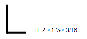
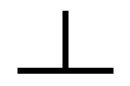
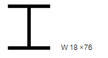
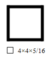

<!--สมมติว่าเริ่มไฟล์เป็นบรรทัดแรก -->
<!--!#@ Code: TSS04207009L2-6 -->
<!--!#@ Title: สมบัติของวัสดุ และการใช้งานเหล็กรูปพรรณ -->
<!--!#@ Subject: ช่างประกอบท่อ ระดับ 2 -->
<!--!#@ Desc: -->
<!--!#@ Q1 -->
วัสดุใด<b><u>ไม่จัด</b></u>อยู่ในวัสดุประเภทโลหะ  
<!--!#@ C -->
เหล็ก  
<!--!#@ C -->
อะลูมิเนียม  
<!--!#@ C* -->
พอลิเมอร์  
<!--!#@ C -->
นิเกิล  

<!--!#@ Q2 -->
วัสดุชนิดใดที่นิยมใช้ทำเป็นลวดไฟฟ้า  
<!--!#@ C -->
ตะกั่ว  
<!--!#@ C -->
เงิน  
<!--!#@ C* -->
ทองแดง  
<!--!#@ C -->
เหล็ก  

<!--!#@ Q3 -->
วัสดุชนิดใดที่นิยมใช้ทำฉนวนไฟฟ้า  
<!--!#@ C -->
อะลูมิเนียม  
<!--!#@ C -->
ทองแดง  
<!--!#@ C* -->
พอลิเอทิลีน  
<!--!#@ C -->
ฟีนอลิก  

<!--!#@ Q4 no random -->
เหล็กที่ผ่านกระบวนการรีดร้อนและรีดเย็นมีความแตกต่างกันอย่างไร  
<!--!#@ C* -->
สี  
<!--!#@ C -->
น้ำหนัก  
<!--!#@ C -->
ปริมาณคาร์บอน  
<!--!#@ C -->
ถูกทุกข้อ  

<!--!#@ Q5 -->
แรงที่กระทำต่อพื้นที่หน้าตัด เรียกว่าอย่างไร  
<!--!#@ C* -->
ความเค้น  
<!--!#@ C -->
ความเครียด  
<!--!#@ C -->
ความล้า  
<!--!#@ C -->
ความแข็ง  
 
<!--!#@ Q6 no random -->
เหล็กกล้าที่มีความแข็งสูง จะส่งผลอย่างไรต่อสมบัติทางกลด้านอื่น  
<!--!#@ C -->
อัตราการยึดตัวสูง	  
<!--!#@ C* -->
อัตราการยึดตัวน้อย  
<!--!#@ C -->
ความแข็งแรงต่ำ  
<!--!#@ C -->
ถูกทั้งข้อ ก และ ค  

<!--!#@ Q7 -->
ข้อใดกล่าวไม่ถูกต้องเกี่ยวกับเหล็กกล้าไร้สนิม  
<!--!#@ C -->
ทนต่อการกัดกร่อน	  
<!--!#@ C* -->
นำความร้อนได้ดี  
<!--!#@ C -->
อัตราการบิดตัวสูงเมื่อได้รับความร้อน	  
<!--!#@ C -->
โครเมียมออกไซด์เกิดขึ้นที่ผิว  

<!--!#@ Q8 no random -->
ความสูงของเหล็กโครงสร้างดังรูปคือ  
  
<!--!#@ C* -->
2 นิ้ว	   
<!--!#@ C -->
1 ½  นิ้ว  
<!--!#@ C -->
2 3/16 นิ้ว    
<!--!#@ C -->
3/16 นิ้ว   

<!--!#@ Q9 -->
เหล็กโครงสร้างดังรูปคือเหล็กชนิดใด  
  
<!--!#@ C -->
เหล็กฉากรูป C   
<!--!#@ C -->
เหล็กฉากรูป L  
<!--!#@ C* -->
เหล็กฉากรูป T   
<!--!#@ C -->
เหล็กฉากรูป I   

<!--!#@ Q10 no random -->
ความสูงของเหล็กโครงสร้างดังรูปคือ	  
  
<!--!#@ C -->
18 นิ้ว   
<!--!#@ C -->
17 ½  นิ้ว  
<!--!#@ C -->
17 นิ้ว    
<!--!#@ C* -->
76 นิ้ว   

<!--!#@ Q11 no random -->
ความโตภายในของเหล็กโครงสร้างดังรูปมีค่าเท่าไร              
  
<!--!#@ C -->
4 นิ้ว  
<!--!#@ C* -->
3 ⅜ นิ้ว   
<!--!#@ C -->
4 ⅜ นิ้ว    
<!--!#@ C -->
5/16 นิ้ว   