<!--สมมติว่าเริ่มไฟล์เป็นบรรทัดแรก -->
<!--!#@ Code: TSS04207009L2-7 -->
<!--!#@ Title: การอ่านแบบงานประกอบ และสัญลักษณ์งานเชื่อมที่ใช้ในแบบงานท่อ -->
<!--!#@ Subject: ช่างประกอบท่อ ระดับ 2 -->
<!--!#@ Desc: -->
<!--!#@ Q1 -->
สัญลักษณ์ใดที่จะต้องกำหนดจึงจะถูกต้อง  
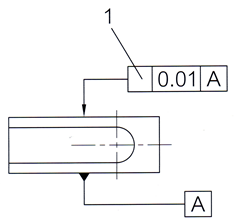  
<!--!#@ C -->
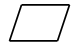  
<!--!#@ C* -->
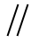    
<!--!#@ C -->
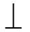    
<!--!#@ C -->
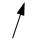    

<!--!#@ Q2 no random -->
จากภาพฉายชิ้นงาน 1-4 ภาพใดถูกต้อง  
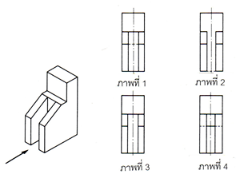  
<!--!#@ C -->
ภาพที่ 1  
<!--!#@ C -->
ภาพที่ 2   
<!--!#@ C* -->
ภาพที่ 3  
<!--!#@ C -->
ภาพที่ 4  

<!--!#@ Q3 -->
จากภาพฉายชิ้นงาน 1-4 ภาพใดถูกต้อง  
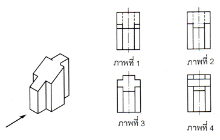  
<!--!#@ C -->
ภาพที่ 1  
<!--!#@ C* -->
ภาพที่ 2   
<!--!#@ C -->
ภาพที่ 3  
<!--!#@ C -->
ภาพที่ 4  

<!--!#@ Q4 no random -->
จากภาพฉายชิ้นงาน 1-4 ภาพใดถูกต้อง  
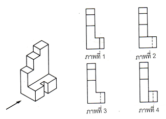  
<!--!#@ C -->
ภาพที่ 1  
<!--!#@ C -->
ภาพที่ 2   
<!--!#@ C* -->
ภาพที่ 3  
<!--!#@ C -->
ภาพที่ 4  

<!--!#@ Q5 -->
ข้อใดคือสัญลักษณ์ของท่อแก๊ส  
<!--!#@ C -->
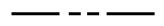  
<!--!#@ C -->
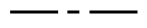    
<!--!#@ C -->
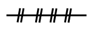    
<!--!#@ C* -->
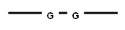    

<!--!#@ Q6 -->
ข้อใดคือสัญลักษณ์ของท่อน้ำร้อน  
<!--!#@ C* -->
  
<!--!#@ C -->
    
<!--!#@ C -->
    
<!--!#@ C -->
    

<!--!#@ Q7 -->
ข้อใดคือสัญลักษณ์ของท่อน้ำเย็น  
<!--!#@ C -->
  
<!--!#@ C* -->
    
<!--!#@ C -->
    
<!--!#@ C -->
    

<!--!#@ Q8 -->
จากรูปคือสัญลักษณ์อะไร  
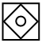    
<!--!#@ C -->
ท่อแยกแก๊ส  
<!--!#@ C -->
ท่อแยกไขมัน  
<!--!#@ C* -->
ท่อแยกน้ำมัน    
<!--!#@ C -->
ท่อแยกน้ำ  

<!--!#@ Q9 -->
สัญลักษณ์ดังรูปเป็นรอยต่อแบบใด  
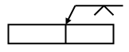  
<!--!#@ C* -->
แนวเชื่อมต่อชนบากร่องวีด้านเดียว  
<!--!#@ C -->
แนวเชื่อมต่อขอบ  
<!--!#@ C -->
แนวเชื่อมต่อชนบากร่องวี 2 ด้าน  
<!--!#@ C -->
แนวเชื่อมต่อเกย  

<!--!#@ Q10 -->
ข้อใดคือ สัญลักษณ์ ของรอยต่อชน  
<!--!#@ C -->
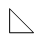  
<!--!#@ C* -->
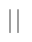    
<!--!#@ C -->
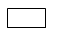    
<!--!#@ C -->
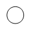    

<!--!#@ Q11 no random -->
สัญลักษณ์ข้องอ (Elbows) 45 องศา คือข้อใด  
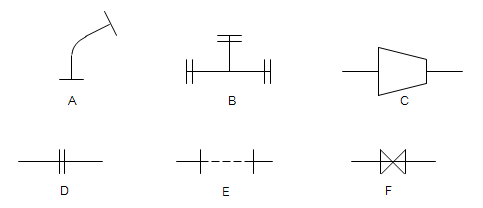   
<!--!#@ C* -->
A  
<!--!#@ C -->
B  
<!--!#@ C -->
C  
<!--!#@ C -->
D  

<!--!#@ Q12 no random -->
สัญลักษณ์ข้อต่อตัวที (Tee) คือข้อใด  
    
<!--!#@ C -->
A  
<!--!#@ C* -->
B  
<!--!#@ C -->
C  
<!--!#@ C -->
D  

<!--!#@ Q13 no random -->
ข้อใดคือสัญลักษณ์ของข้อต่อลดขนาดร่วมศูนย์  
    
<!--!#@ C -->
A  
<!--!#@ C -->
B  
<!--!#@ C -->
C  
<!--!#@ C* -->
D  