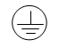

<!--สมมติว่าเริ่มไฟล์เป็นบรรทัดแรก -->
<!--!#@ Code: TSS04415001L1-1 -->
<!--!#@ Title: ความปลอดภัยเบื้องต้นในการปฏิบัติงานทางไฟฟ้า -->
<!--!#@ Subject: ช่างไฟฟ้าภายในอาคาร ระดับ 1 -->
<!--!#@ Desc: -->
<!--!#@ Q1 -->
การปฏิบัติงานทางไฟฟ้าในสถานที่ ที่ต่ำกว่าระดับผิวดิน เช่น ห้องใต้ดิน ซึ่งมีน้ำ เป็นต้น เพื่อความปลอดภัยในการปฏิบัติงานที่ติดต่อกันเป็นเวลานาน แสงสว่างที่ใช้ควรได้จากข้อใด
<!--!#@ C -->  
เทียนไข 
<!--!#@ C* -->  
แบตเตอรี่และดวงโคม  
<!--!#@ C -->
ตะเกียงน้ำมัน   
<!--!#@ C -->
ไฟฉายมือถือแบบธรรมดา (ปลอดภัย)

<!--!#@ Q2 -->
เพลิงไหม้ที่มีสาเหตุจากเครื่องใช้ไฟฟ้าหรืออุปกรณ์ไฟฟ้า เป็นเพลิงไหม้ประเภท (Class) ใด   
<!--!#@ C -->
Class A
<!--!#@ C -->  
Class B   
<!--!#@ C* -->
Class C  
<!--!#@ C -->
Class D

<!--!#@ Q3 -->
การปฐมพยาบาลเบื้องต้นผู้ถูกช็อกไฟฟ้า (ไฟฟ้าดูด) หมดสติ กล้ามเนื้อหดตัวจนหัวใจหยุดเต้น หยุดหายใจหรือมีเสียงเล็กน้อย วิธีที่ใช้และได้ผลเมื่อประสบเหตุคือข้อใด    
<!--!#@ C -->
ส่งโรงพยาบาล 
<!--!#@ C -->  
ให้ลมหายใจด้วยออกซิเจน
<!--!#@ C -->  
ทายาหม่อง  
<!--!#@ C* -->
ให้ลมหายใจด้วยปากสลับกับการนวด(การปั๊ม)หัวใจ

<!--!#@ Q4 -->
ข้อใดไม่ใช่สิ่งสำคัญที่ต้องคำนึงถึงเมื่อพบผู้บาดเจ็บจากการถูกช็อกไฟฟ้า (ไฟฟ้าดูด)    
<!--!#@ C -->
ตัดวงจรแหล่งจ่ายไฟฟ้า   
<!--!#@ C --> 
ทำแผลไฟไหม้
<!--!#@ C -->  
ขอความช่วยเหลือทางการแพทย์    
<!--!#@ C* -->
ให้ผู้บาดเจ็บดื่มเครื่องดื่มที่มีรสหวาน

<!--!#@ Q5 -->
หากพบผู้ถูกช็อกไฟฟ้า (ไฟฟ้าดูด) ต้องทำอย่างไร   
<!--!#@ C -->
ใช้วัสดุที่เป็นฉนวนทางไฟฟ้าดึงออกมา	  
<!--!#@ C -->
ใช้มือดึงออกมาโดยเร็ว 
<!--!#@ C -->  
ยื่นไม้ให้จับแล้วดึงออกมา    
<!--!#@ C* -->
ตัดวงจรแหล่งจ่ายไฟฟ้าออก  

<!--!#@ Q6 -->
สัญลักษณ์  หมายความว่าอย่างไร  
<!--!#@ C* -->
ต้องต่อลงดิน 
<!--!#@ C -->  
ใส่ฝาปิดมิดชิด
<!--!#@ C -->  
ทำการห่อหุ้มเพื่อป้องกันมิให้น้ำเข้า   
<!--!#@ C -->
ถูกทั้งข้อ ก. และ ค.

<!--!#@ Q7 no random -->
ความปลอดภัยในการทำงานอาศัยหลักพื้นฐาน ดังนี้   
<!--!#@ C -->
หลักการทางด้านวิศวกรรม (Engineering)  
<!--!#@ C -->
หลักการศึกษาอบรม (Education) 
<!--!#@ C -->  
หลักการบังคับให้เป็นไปตามกฎระเบียบ (Enforcement)    
<!--!#@ C* -->
ถูกทุกข้อ

<!--!#@ Q8 -->
ก่อนใช้เครื่องมือในงานติดตั้งทางไฟฟ้า ควรปฏิบัติตามข้อใด     
<!--!#@ C -->
ใช้เครื่องมือที่มีตรารับประกันคุณภาพมาตรฐาน 
<!--!#@ C -->  
ตรวจสอบระบบไฟฟ้า
<!--!#@ C -->  
แต่งกายด้วยชุดที่ทำจากฉนวนทางไฟฟ้าให้รัดกุม   
<!--!#@ C* --> 
ตรวจสอบว่าเครื่องมือนั้นทำงานได้อย่างถูกต้องและไม่บกพร่อง

<!--!#@ Q9 -->
ขนาดสายดินของวงจรไฟฟ้าของระบบดิน (กราวด์) ต้องเลือกจากการพิจารณาอะไร   
<!--!#@ C* --> 
ขนาดของสายประธาน 
<!--!#@ C -->  
ขนาดของอุปกรณ์ไฟฟ้า
<!--!#@ C -->  
ขนาดของเครื่องป้องกันกระแสเกินที่ป้องกันวงจร   
<!--!#@ C -->
ขนาดเท่าไรก็ได้

<!--!#@ Q10 -->
ขนาดสายดินของวงจรไฟฟ้าของอุปกรณ์ไฟฟ้าต้องเลือกจากการพิจารณาอะไร   
<!--!#@ C -->
ขนาดของสายประธาน 
<!--!#@ C -->  
ขนาดของอุปกรณ์ไฟฟ้า
<!--!#@ C* -->  
ขนาดของเครื่องป้องกันกระแสเกินที่ป้องกันวงจร   
<!--!#@ C -->
ขนาดเท่าไรก็ได

<!--!#@ Q11 -->
ข้อใดคืออุปกรณ์ป้องกันส่วนบุคคลเบื้องต้น
<!--!#@ C* -->  
ถุงมือ หมวกนิรภัย แว่นตานิรภัย เอียร์ปลั๊ก(จุกอุดหู) รองเท้านิรภัย 
<!--!#@ C -->  
ถุงมือ หมวกนิรภัย เข็มขัดนิรภัย แว่นตานิรภัย
<!--!#@ C -->  
ถุงมือ หมวกนิรภัย เข็มขัดนิรภัย รองเท้านิรภัย   
<!--!#@ C -->
ถุงมือ หมวกนิรภัย เข็มขัดนิรภัย รองเท้าพื้นยางหุ้มข้อ เอียร์ปลั๊ก

<!--!#@ Q12 -->
ขณะเพลิงกำลังลุกไหม้ มีองค์ประกอบตามข้อใด  
<!--!#@ C* -->
ออกซิเจน ปฏิกิริยาทางเคมี ความร้อน เชื้อเพลิง  
<!--!#@ C -->
ไฮโดรเจน ปฏิกิริยาทางเคมี ความร้อน เชื้อเพลิง
<!--!#@ C -->  
ออกซิเจน ความร้อน เชื้อเพลิง   
<!--!#@ C -->
ไฮโดรเจน ปฏิกิริยาทางเคมี ความร้อน

<!--!#@ Q13 -->
ดินในความหมายทางไฟฟ้าหมายถึงข้อใด
<!--!#@ C* -->  
มีศักย์ไฟฟ้าเป็นศูนย์ 
<!--!#@ C -->  
มีศักย์ไฟฟ้าต่ำสุดในระบบไฟฟ้า
<!--!#@ C -->  
ไม่มีกระแสไฟฟ้า   
<!--!#@ C -->
มีกระแสไฟฟ้าต่ำสุดในระบบไฟฟ้า

<!--!#@ Q14 no random -->
การต่อสายลงดินมีวัตถุประสงค์อย่างไร 
<!--!#@ C -->  
เพื่อสามารถนำกระแสไฟฟ้าผิดพร่องลงดิน  
<!--!#@ C --> 
ทำให้บริภัณฑ์ไฟฟ้าทำงานได้เหมาะสมตามหน้าที่
<!--!#@ C -->  
ทำให้การติดตั้งทางไฟฟ้าเหมาะสม ปลอดภัย น่าเชื่อถือ    
<!--!#@ C* -->
ถูกทุกข้อ

<!--!#@ Q15 no random -->
อุบัติเหตุจากการปฏิบัติงาน เกี่ยวกับไฟฟ้ามีมูลเหตุสำคัญมาจากข้อใด 
<!--!#@ C -->  
การใช้เครื่องมือชำรุด ไม่ถูกต้องตามประเภท ขนาด และลักษณะงาน 
<!--!#@ C -->  
การทำงานโดยขาดความระมัดระวัง ไม่คิดก่อนลงมือทำงาน
<!--!#@ C -->  
มีความรู้ไม่เพียงพอต่องานที่ทำ   
<!--!#@ C* -->
ถูกทุกข้อ

<!--!#@ Q16 -->
การต่อสายดินกับหลักดิน ตามมาตรฐานการติดตั้งทางไฟฟ้ากำหนดให้ ค่าความต้านทานระหว่างหลักดิน (อิเล็กโตรดดิน) กับดินต้องไม่เกินเท่าใด 
<!--!#@ C -->  
0 โอห์ม 
<!--!#@ C -->  
2 โอห์ม
<!--!#@ C -->  
4 โอห์ม   
<!--!#@ C* -->
5 โอห์ม