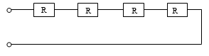

<!--สมมติว่าเริ่มไฟล์เป็นบรรทัดแรก -->
<!--!#@ Code: TSS04415001L1-2 -->
<!--!#@ Title: คุณสมบัติของสายไฟฟ้า (Cable) ตัวนำแท่ง (Bus bar) ตัวต้านทาน และตัวเหนี่ยวนำ -->
<!--!#@ Subject: ช่างไฟฟ้าภายในอาคาร ระดับ 1 -->
<!--!#@ Desc: -->
<!--!#@ Q1 -->
ถ้าพื้นที่หน้าตัดของตัวนำไฟฟ้าเพิ่มขึ้น จะมีผลทำให้ความต้านทานของตัวนำนั้นเป็นอย่างไร
<!--!#@ C* -->  
ลดลง 
<!--!#@ C -->  
คงเดิม  
<!--!#@ C -->
เพิ่มขึ้นแต่มีผลเสียกับอุปกรณ์ไฟฟ้า   
<!--!#@ C -->
เพิ่มขึ้นแต่ไม่มีผลเสียกับอุปกรณ์ไฟฟ้า

<!--!#@ Q2 -->
หน่วยวัดค่าความต้านทานทางไฟฟ้าเรียกว่าอะไร   
<!--!#@ C -->
แอมแปร์
<!--!#@ C* -->  
โอห์ม   
<!--!#@ C -->
วัตต์  
<!--!#@ C -->
โวลต์

<!--!#@ Q3 no random -->
ถ้าความยาวของตัวนำไฟฟ้าเพิ่มขึ้น จะมีผลทำให้ความต้านทานของตัวนำนั้นเป็นอย่างไร   
<!--!#@ C* -->
เพิ่มขึ้น 
<!--!#@ C -->  
คงเดิม
<!--!#@ C -->  
ลดลง  
<!--!#@ C -->
ลดลงแต่ไม่มีผลเสียกับอุปกรณ์ไฟฟ้า

<!--!#@ Q4 -->
ฉนวนทางไฟฟ้าของสายไฟฟ้าที่ใช้สำหรับงานเดินสายไฟฟ้าอาคารที่มีแรงดันไฟฟ้าไม่เกิน 750 โวลต์ โดยทั่วไปทำจากวัสดุอะไร   
<!--!#@ C -->
ยางหุ้มด้วยฝ้าย   
<!--!#@ C* --> 
สารประกอบโพลิไวนิลคลอไรด์ (พีวีซี)
<!--!#@ C -->  
อินาเมล    
<!--!#@ C -->
ฝ้าย

<!--!#@ Q5 -->
ตัวนำไฟฟ้าที่ใช้ทำสายไฟฟ้าสำหรับงานเดินสายไฟฟ้าอาคาร โดยทั่วไปทำจากโลหะอะไร  
<!--!#@ C -->
ทองเหลือง	  
<!--!#@ C -->
เหล็ก 
<!--!#@ C -->  
ตะกั่ว    
<!--!#@ C* -->
ทองแดง  

<!--!#@ Q6 -->
สีของฉนวนของสายไฟฟ้าสำหรับระบบแรงดันไฟฟ้าต่ำ สีสำหรับเส้นเป็นกลาง (N) กำหนดเป็นสีอะไร
<!--!#@ C -->  
สีแดงหรือสีแดงแถบดำ 
<!--!#@ C* -->  
สีฟ้า  
<!--!#@ C -->
สีเขียว หรือสีเขียวแถบเหลือง   
<!--!#@ C -->
สีดำ

<!--!#@ Q7 -->
สีของฉนวนของสายไฟฟ้าสำหรับระบบแรงดันไฟฟ้าต่ำ สีสำหรับสายดินหรือสายในงานป้องกัน กำหนดเป็นสีอะไร   
<!--!#@ C -->
สีแดงหรือสีแดงแถบดำ
<!--!#@ C -->  
สีฟ้า   
<!--!#@ C* -->
สีเขียวแถบเหลือง  
<!--!#@ C -->
สีดำ

<!--!#@ Q8 -->
ตัวต้านทานตัวละ 9 โอห์ม จำนวน 4 ตัว ต่อกันแบบอนุกรม ค่าของความต้านทานรวมเป็นเท่าไร   

<!--!#@ C -->  
18 โอห์ม 
<!--!#@ C -->  
27 โอห์ม
<!--!#@ C* -->  
36 โอห์ม  
<!--!#@ C -->
45 โอห์ม

<!--!#@ Q9 -->
ตัวต้านทานตัวละ 4 โอห์ม จำนวน 4 ตัว ต่อกันแบบขนาน ค่าของความต้านทานรวมเป็นเท่าไร   

<!--!#@ C -->  
7 โอห์ม   
<!--!#@ C --> 
5 โอห์ม
<!--!#@ C -->  
3 โอห์ม    
<!--!#@ C* -->
1 โอห์ม

<!--!#@ Q10 -->
ตัวต้านทาน ตัวละ 8 โอห์ม จำนวน 2 ตัว ต่อกันแบบขนาน แล้วนำมาต่ออย่างอนุกรมกับตัวต้านทาน 6 โอห์ม จำนวน 1 ตัว ค่าของความต้านทานรวมเป็นเท่าไร  

<!--!#@ C -->  
32 โอห์ม  
<!--!#@ C -->
24 โอห์ม 
<!--!#@ C -->  
20 โอห์ม    
<!--!#@ C* -->
10 โอห์ม

<!--!#@ Q11 -->
ตัวต้านทาน 10 โอห์ม ขนาด 40 วัตต์ ที่ 220 โวลต์ สามารถทนกระแสไฟฟ้าได้สูงสุดเท่าใด
<!--!#@ C -->  
0.1 แอมแปร์	 
<!--!#@ C* -->
0.2 แอมแปร์  
<!--!#@ C -->
0.3 แอมแปร์	   
<!--!#@ C -->
0.4 แอมแปร์

<!--!#@ Q12 -->
โหลดไฟฟ้า A มีความต้านทานไฟฟ้า 1 เมกะโอห์ม โหลดไฟฟ้า B มีความต้านทานไฟฟ้า 1 กิโลโอห์ม โหลดไฟฟ้า C มีความต้านทานไฟฟ้า 1 โอห์ม ต่อโดยอนุกรม โหลดไฟฟ้ารวม (A B และC) มีค่าเท่าใด   
<!--!#@ C* -->
1,001,001 โอห์ม
<!--!#@ C -->  
1,001 เมกะโอห์ม   
<!--!#@ C -->
1,001,010 โอห์ม  
<!--!#@ C -->
1,001 กิโลโอห์ม

<!--!#@ Q13 no random -->
โดยทั่วไปอุณหภูมิโดยรอบมีผลกระทบต่อค่าความต้านทานของตัวนำในสายไฟฟ้าอย่างไร    
<!--!#@ C* -->
เมื่ออุณหภูมิโดยรอบสูงขึ้น ค่าความต้านทานสูงขึ้น  
<!--!#@ C --> 
เมื่ออุณหภูมิโดยรอบสูงขึ้น ค่าความต้านทานลดลง 
<!--!#@ C -->  
อุณหภูมิโดยรอบไม่มีผลต่อค่าความต้านทาน  
<!--!#@ C -->
ไม่มีข้อถูก

<!--!#@ Q14 -->
สายไฟฟ้ายาว 15 เมตร คิดเป็นกี่มิลลิเมตร   
<!--!#@ C -->
150   
<!--!#@ C --> 
1,500
<!--!#@ C* -->  
15,000    
<!--!#@ C -->
150,000