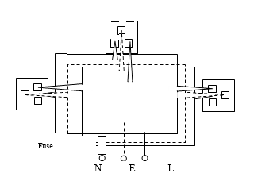

<!--สมมติว่าเริ่มไฟล์เป็นบรรทัดแรก -->
<!--!#@ Code: TSS04415001L1-4 -->
<!--!#@ Title: อุปกรณ์สำหรับการประกอบการติดตั้ง การเดินสายไฟฟ้าและระบบไฟฟ้า -->
<!--!#@ Subject: ช่างไฟฟ้าภายในอาคาร ระดับ 1 -->
<!--!#@ Desc: -->
<!--!#@ Q1 no random -->
การเดินสายไฟฟ้าในท่อโลหะ ถ้าต้องการต่อสายไฟฟ้าจะต้องกระทำที่ใด  
<!--!#@ C -->
ในกล่องต่อสายไฟฟ้าเท่านั้น  
<!--!#@ C* -->
ในกล่องต่อสายหรือในท่อโลหะ  
<!--!#@ C -->
ในกล่องต่อสายหรือในท่อโลหะ  
<!--!#@ C -->
จุดใดก็ได้ แต่ต้องต่อสายลงดินให้ถูกต้อง

<!--!#@ Q2 no random -->
กรณีที่ต้องการใช้หลอดไฟฟ้า ขนาด 100 วัตต์ 110 โวลต์ จำนวน 2 หลอด ต่อกับแหล่งจ่ายไฟฟ้า 220 โวลต์ เพื่อไม่ให้เกิดความเสียหายแก่หลอด ต้องต่อหลอดทั้งสองนี้อย่างไร  
<!--!#@ C* -->
แบบอนุกรมก่อนนำไปต่อกับแหล่งจ่ายไฟฟ้า 220 โวลต์   
<!--!#@ C -->
แบบขนานก่อนนำไปต่อกับแหล่งจ่ายไฟฟ้า 220 โวลต์  
<!--!#@ C -->
แบบผสม ก่อนนำไปต่อกับแหล่งจ่ายไฟฟ้า 220 โวลต์  
<!--!#@ C -->
ผิดหมดทุกข้อ  

<!--!#@ Q3 no random -->
ข้อใดต่อไปนี้เป็นการปฏิบัติที่ดี เมื่อทำงานติดตั้งทางไฟฟ้า   
<!--!#@ C -->
สวมรองเท้าพื้นยางให้ถูกต้องเสมอ   
<!--!#@ C -->
ไม่ทำงานกับบริภัณฑ์มีไฟฟ้า   
<!--!#@ C -->
รายงานสถานการณ์ไม่ปลอดภัยซึ่งท่านไม่สามารถแก้ไขด้วยตนเอง ทุกครั้ง    
<!--!#@ C* -->
ถูกทุกข้อ  

<!--!#@ Q4 -->
ข้อใดไม่ถูกต้อง  
<!--!#@ C* -->
พิกัดกระแสของเส้นฟิวส์ต้องสูงกว่าขั้วรับฟิวส์   
<!--!#@ C -->
เซอร์กิตเบรกเกอร์ต้องเป็นแบบปลดได้โดยอิสระและต้องปลดสับได้ด้วยมือ     
<!--!#@ C -->
ตัวนำแท่ง (บัสบาร์) มีทั้งชนิดทองแดงและชนิดอะลูมิเนียม  
<!--!#@ C -->
ขนาดของท่อร้อยสายไฟฟ้า หมายถึง เส้นผ่านศูนย์กลางภายในของท่อร้อยสายไฟฟ้า    

<!--!#@ Q5 -->
สำหรับบริภัณฑ์ไฟฟ้าทุกชนิด สายไฟฟ้าที่ใช้เป็นสายดินต้องมีขนาดไม่น้อยกว่า  
<!--!#@ C -->
0.5 ตารางมิลลิเมตร   
<!--!#@ C* -->
1.5 ตารางมิลลิเมตร  
<!--!#@ C -->
2.5 ตารางมิลลิเมตร  
<!--!#@ C -->
4 ตารางมิลลิเมตร 

<!--!#@ Q6 -->
เซอร์กิตเบรกเกอร์มีหน้าที่อย่างไร   
<!--!#@ C -->
ป้องกันไม่ให้แรงดันไฟฟ้าตก	  
<!--!#@ C* -->
ป้องกันไม่ให้กระแสไฟฟ้าไหลมากเกินพิกัด  
<!--!#@ C -->
ลดค่าความต้านทานของสายไฟฟ้า  
<!--!#@ C -->
เพิ่มกำลังไฟฟ้า 

<!--!#@ Q7 -->
มอเตอร์ไฟฟ้าขนาดไม่เกิน180 วัตต์ (¼ แรงม้า) จะต้องมีอุปกรณ์ป้องกันกระแสเกิน เรียกว่าอะไร   
<!--!#@ C -->
แมกเนติกสวิตช์   
<!--!#@ C -->
แอร์เซอร์กิตเบรกเกอร์   
<!--!#@ C -->
คอนแทกเตอร์   
<!--!#@ C* -->
ฟิวส์   

<!--!#@ Q8 no random -->
การเลือกใช้ฟิวส์จะต้องคำนึงถึงข้อใด  
<!--!#@ C -->
ความต้านทานของสายไฟฟ้า	  
<!--!#@ C -->
กระแสไฟฟ้า  
<!--!#@ C -->
แรงดันไฟฟ้า   
<!--!#@ C* -->
ถูกทั้ง ข้อ ข. และ ค. 

<!--!#@ Q9 -->
แท่งอิเล็กโตรดดิน (หลักดิน) ที่ใช้ในการต่อลงดิน ขนาดเส้นผ่านศูนย์กลางต้องไม่น้อยกว่า  
<!--!#@ C -->
6 มิลลิเมตร (¼”)  
<!--!#@ C* -->
16 มิลลิเมตร (⅝”)  
<!--!#@ C -->
9 มิลลิเมตร(⅜”)  
<!--!#@ C -->
12 มิลลิเมตร (½”)  

<!--!#@ Q10 -->
สำหรับระบบแรงดันไฟฟ้า 220 โวลต์ 1 เฟส 2 สาย ให้ติดตั้งระบบคาร์ทริดจ์ฟิวส์ ตัดสายไฟฟ้าที่เส้นไหน
<!--!#@ C -->  

<!--!#@ C -->  

<!--!#@ C -->  

<!--!#@ C* -->  

<!--!#@ Q11 no random -->  
การต่อวงจรไฟฟ้าของหลอดไฟฟ้าขนาด 220 โวลต์ กับแหล่งจ่ายไฟฟ้า 220 โวลต์ โดยทั่วไปเป็นการต่อแบบอะไร
<!--!#@ C* -->  
แบบขนาน   
<!--!#@ C -->
แบบอนุกรม  
<!--!#@ C -->
แบบผสม   
<!--!#@ C -->
แบบอนุกรมหรือแบบขนานก็ได้  

<!--!#@ Q12 -->
ความถี่มาตรฐานของระบบไฟฟ้าที่ใช้ในประเทศไทย มีค่าเท่าไร   
<!--!#@ C -->
25 เฮิรตซ์  
<!--!#@ C* -->
50 เฮิรตซ์  
<!--!#@ C -->
110 เฮิรตซ์	  
<!--!#@ C -->
220 เฮิรตซ์  

<!--!#@ Q13 -->
ระบบไฟฟ้า 1 เฟส 2 สาย ที่ผู้ใช้ไฟฟ้าตามที่อยู่อาศัยในประเทศไทย เป็นระบบใด  
<!--!#@ C -->
220 แอมแปร์  
<!--!#@ C -->
110 โวลต์  
<!--!#@ C -->
110 แอมแปร์  
<!--!#@ C* -->
220 โวลต์  

<!--!#@ Q14 -->
ข้อใดต่อไปนี้กล่าวไม่ถูกต้อง  
<!--!#@ C -->
ในท่อร้อยสายต้องไม่มีท่อสำหรับงานอื่นที่ไม่ใช่งานไฟฟ้าเดินร่วมอยู่ด้วย  
<!--!#@ C -->
การติดตั้งทางไฟฟ้าที่ผ่านผนังต้องมีการป้องกันไม่ให้เพลิงลุกลามตามมาตรฐานการป้องกันอัคคีภัย  
<!--!#@ C -->
เมื่อเดินช่องร้อยสายผ่านที่อุณหภูมิแตกต่างกันมาก ต้องมีการป้องกันการไหลเวียนของอากาศภายในท่อ  
<!--!#@ C* -->
สายต่อลงดินต้องเป็นสายหุ้มฉนวนเท่านั้น  

<!--!#@ Q15 -->
ข้อใดถูกต้องเกี่ยวกับการเดินสายไฟฟ้าในท่อโลหะอ่อน  
<!--!#@ C* -->
ใช้งานในสถานที่แห้ง  
<!--!#@ C -->
ใช้งานฝังดินโดยตรง  
<!--!#@ C -->
ห้ามใช้ท่อโลหะอ่อนที่มีขนาดเล็กกว่า 16 มิลลิเมตร	  
<!--!#@ C -->
ใช้เป็นตัวนำสำหรับต่อลงดิน

<!--!#@ Q16 -->
ข้อใดต่อไปนี้คืออุปกรณ์ไฟฟ้า (Electrical Devices)  
<!--!#@ C -->
คอมพิวเตอร์  
<!--!#@ C -->
เครื่องซักผ้าไฟฟ้า  
<!--!#@ C -->
สว่านไฟฟ้า   
<!--!#@ C* -->
เซอร์กิตเบรกเกอร์  

<!--!#@ Q17 -->
ฟิวส์ (Fuses) เป็นอุปกรณ์ (Devices) ประเภทใด  
<!--!#@ C* -->
อุปกรณ์ป้องกันกระแสเกิน	  
<!--!#@ C -->
อุปกรณ์ป้องกันแรงดันเกิน  
<!--!#@ C -->
อุปกรณ์ป้องกันกระแสไฟฟ้ารั่ว (RCD, GFCI)  
<!--!#@ C -->
อุปกรณ์ป้องกันทางความร้อน  

<!--!#@ Q18 -->     
ในกรณีที่ใช้ฟิวส์เป็นอุปกรณ์ป้องกันกระแสเกินและฟิวส์นั้นขาดอยู่บ่อยๆเพราะใช้กระแสไฟฟ้าเกินวิธี แก้ปัญหา คือการปฏิบัติอย่างไร 
<!--!#@ C -->  
หาฟิวส์ขนาดเดียวกันมาใส่แทน  
<!--!#@ C -->
หาฟิวส์ขนาดโตกว่ามาใส่แทน  
<!--!#@ C -->
ตรวจสอบสายไฟฟ้า เพื่อหาจุดที่เกิดการลัดวงจรขึ้น  
<!--!#@ C* -->
ตรวจสอบขนาดโหลดของวงจรใหม่

<!--!#@ Q19 no random -->
การเดินสายไฟฟ้าด้วยรางเดินสาย (Wireway) ข้อใดถูกต้อง  
<!--!#@ C* --> 
ผลรวมของพื้นที่หน้าตัดของสายไฟฟ้ารวมฉนวนต้องไม่เกินร้อยละ 20 ของพื้นที่หน้าตัดภายในของรางเดินสาย
<!--!#@ C -->  
สายไฟฟ้าที่เดินอยู่ในรางเดินสาย  สามารถต่อสาย ณ จุดใดก็ได้
<!--!#@ C -->  
รางเดินสายที่เป็นโลหะ  ไม่จำเป็นต้องติดตั้งสายต่อลงดินเพิ่ม
<!--!#@ C -->  
ถูกทุกข้อ

<!--!#@ Q20 -->  
ความหมายของคำว่า ปลด ( Trip ) ของเซอร์กิตเบรกเกอร์ ( Circuit Breaker ,CB) คืออะไร 
<!--!#@ C -->  
CB ปลดวงจร  เมื่อเกิดการใช้ไฟฟ้ามาก
<!--!#@ C* -->  
CB ปลดวงจร  เมื่อกระแสไฟฟ้าในวงจรไหลเกินพิกัดที่กำหนดไว้  
<!--!#@ C -->
CB ปลดวงจร  เมื่อใช้งานเกินกำหนดเวลา   
<!--!#@ C -->
CB ปลดวงจร  เมื่อเกิดฟ้าผ่า  

<!--!#@ Q21 -->
พิกัดตัดกระแส (Interrupting Rating) คืออะไร   
<!--!#@ C -->
ความโตของเซอร์กิตเบรกเกอร์  
<!--!#@ C -->
คุณสมบัติด้านแรงดันของเซอร์กิตเบรกเกอร์  
<!--!#@ C* -->
ความสามารถในการตัดกระแสไฟฟ้าสูงสุด เมื่อเกิดการลัดวงจร  
<!--!#@ C -->
รุ่นการผลิต ของเซอร์กิตเบรกเกอร์  

<!--!#@ Q22 -->
ข้อใดไม่ใช่หน้าที่ของโหลดเซ็นเตอร์ (Load Center)   
<!--!#@ C -->
เป็นศูนย์กลางในการจ่ายกระแสไฟฟ้า ไปยังวงจรย่อยต่าง ๆ  
<!--!#@ C -->
เป็นอุปกรณ์ตัดต่อกระแสไฟฟ้าอัตโนมัติให้กับโหลดในวงจรต่าง ๆ    
<!--!#@ C -->
ตัดกระแสไฟฟ้า โดยอัตโนมัติเมื่อเกิดการลัดวงจร   
<!--!#@ C* -->
ป้องกันมิให้มาตรพลังงานไฟฟ้าชำรุด

<!--!#@ Q23 -->
ให้หาขนาดเซอร์กิตเบรกเกอร์ และสายวงจรย่อยที่เหมาะสมและประหยัด เมื่อในวงจรย่อยมีโหลดดังนี้    
หลอดไฟฟ้า(หลอดไส้) ขนาด 100 W 220 V จำนวน 10 ดวง  
หลอดไฟฟ้า (หลอดไส้)  ขนาด 200 W 220 V จำนวน 5 ดวง 
<!--!#@ C -->  
CB 10 AT   สาย 2.5 mm2 VAF  
<!--!#@ C -->
CB 10 AT   สาย 4 mm2 VAF  
<!--!#@ C* -->
CB 15 AT   สาย 2.5 mm2 VAF  
<!--!#@ C -->
CB 15 AT   สาย 4 mm2 VAF

<!--!#@ Q24 -->
ในการเลือกใช้เซอร์กิตเบรกเกอร์ขนาดต่ำสุด จะต้องมีขนาดเป็นกี่เท่าของกระแสไฟฟ้าที่คาดว่าจะใช้งานจริง 
<!--!#@ C* -->  
1.0 เท่า                     
<!--!#@ C -->
1.25 เท่า                   
<!--!#@ C -->
2.0 เท่า  
<!--!#@ C -->
2.5 เท่า

<!--!#@ Q25 -->
ในการเดินสายฝังดินด้วยท่อโลหะหนาควรฝังลึกไม่น้อยกว่าเท่าใด   
<!--!#@ C* -->
15 เซนติเมตร                      
<!--!#@ C -->
60 เซนติเมตร  
<!--!#@ C -->
30 เซนติเมตร  
<!--!#@ C -->
45 เซนติเมตร