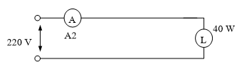
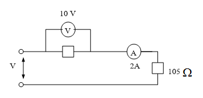
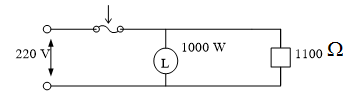
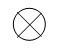
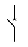
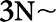
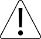

<!--สมมติว่าเริ่มไฟล์เป็นบรรทัดแรก -->
<!--!#@ Code: TSS04415001L1-8 -->
<!--!#@ Title: ความรู้ทั่วไปเกี่ยวกับไฟฟ้าและมาตรฐานการติดตั้ง -->
<!--!#@ Subject: ช่างไฟฟ้าภายในอาคาร ระดับ 1 -->
<!--!#@ Desc: -->
<!--!#@ Q1 -->
หนึ่งกิโลวัตต์มีค่าเท่ากับเท่าไร  
<!--!#@ C -->
10,000 วัตต์         
<!--!#@ C* -->
1,000 วัตต์  
<!--!#@ C -->
746 วัตต์             
<!--!#@ C -->
746 วัตต์   

<!--!#@ Q2 -->
หนึ่งยูนิต (UNIT) ซึ่งใช้วัดปริมาณพลังงานไฟฟ้าเพื่อการพานิชย์ คือ  
<!--!#@ C -->
100 วัตต์ ซึ่งใช้เป็นเวลา 1 ชั่วโมง     
<!--!#@ C* -->
1,000 วัตต์ ซึ่งใช้เป็นเวลา 1 ชั่วโมง  
<!--!#@ C -->
100 วัตต์ ซึ่งใช้เป็นเวลา 1/2 ชั่วโมง    
<!--!#@ C -->
1,000 วัตต์ ซึ่งใช้เป็นเวลา 1/2 ชั่วโมง   
     
<!--!#@ Q3 -->
จงคำนวณหาค่ากระแสไฟฟ้าในวงจรไฟฟ้าระบบ 1 เฟส 220 โวลต์ ซึ่งมีดวงโคมไฟฟ้าขนาด 40 วัตต์ ต่ออยู่  
     
<!--!#@ C* -->
0.18 แอมแปร์    
<!--!#@ C -->
5.5 แอมแปร์  
<!--!#@ C -->
8,800 แอมแปร์   
<!--!#@ C -->
0.24 แอมแปร์  

<!--!#@ Q4 -->
จงคำนวณหาค่าแรงดันไฟฟ้าของแหล่งจ่ายไฟฟ้าที่ใช้ในวงจรข้างล่างนี้  
  
<!--!#@ C -->
110 โวลต์   
<!--!#@ C* -->
220 โวลต์   
<!--!#@ C -->
380 โวลต์  
<!--!#@ C -->
800 โวลต์  

<!--!#@ Q5 -->
ตามวงจรข้างล่างนี้ สมควรใช้ฟิวส์ขนาดเท่าไร  
  
<!--!#@ C* -->
5 แอมแปร์       
<!--!#@ C -->
10 แอมแปร์   
<!--!#@ C -->
15 แอมแปร์       
<!--!#@ C -->
30 แอมแปร์  

<!--!#@ Q6 -->
ข้อใดไม่ใช่บริภัณฑ์ทางไฟฟ้า (electrical equipments)  
<!--!#@ C -->
เข็มขัดรัดสายไฟฟ้า              
<!--!#@ C -->
ท่อร้อยสายไฟฟ้า  
<!--!#@ C* -->
ไขควงไฟฟ้า              
<!--!#@ C -->
โทรทัศน์

<!--!#@ Q7 -->
สัญลักษณ์ตามรูป  หมายถึง   
<!--!#@ C -->
สวิตซ์ไฟฟ้า                             
<!--!#@ C -->
เต้ารับไฟฟ้า   
<!--!#@ C* -->
หลอดไฟฟ้า             
<!--!#@ C -->
หวูดสัญญาณ

<!--!#@ Q8 -->
สัญลักษณ์ตามรูป  หมายถึง  
<!--!#@ C -->
สวิตซ์ไฟฟ้า                               
<!--!#@ C -->
เต้ารับไฟฟ้า             
<!--!#@ C* -->
เซอร์กิตเบรกเกอร์               
<!--!#@ C -->
กระดิ่งไฟฟ้า

<!--!#@ Q9 -->
โทรทัศน์เครื่องหนึ่ง  ระบุว่าขนาด 750 วัตต์  เมื่อเปิดใช้งาน 2 ชั่วโมง   จะต้องเสียค่าไฟฟ้ากี่ยูนิต   
<!--!#@ C -->
375 ยูนิต                                
<!--!#@ C* -->
1.5 ยูนิต  
<!--!#@ C -->
750 ยูนิต                                
<!--!#@ C -->
2.0 ยูนิต

<!--!#@ Q10 -->
สัญลักษณ์  หมายความว่าอย่างไร    
<!--!#@ C* -->
แรงดันไฟฟ้าอันตราย              
<!--!#@ C -->
ป้องกันฟ้าผ่า  
<!--!#@ C -->
ป้องกันไฟฟ้ารั่ว             
<!--!#@ C -->
ระวัง

<!--!#@ Q11 no random -->
สัญลักษณ์  หมายความว่าอย่างไร  
<!--!#@ C -->
ไฟฟ้ากระแสสลับ              
<!--!#@ C -->
ไฟฟ้ากระแสสลับ 3 เฟส  
<!--!#@ C* -->
ไฟฟ้ากระแสสลับ 3 เฟส มีสายเป็นกลาง             
<!--!#@ C -->
ผิดทุกข้อ

<!--!#@ Q12 -->
สัญลักษณ์  หมายความว่าอย่างไร  
<!--!#@ C -->
อันตราย             
<!--!#@ C -->
ห้ามเข้า  
<!--!#@ C -->
หยุด             
<!--!#@ C* -->
ระวัง